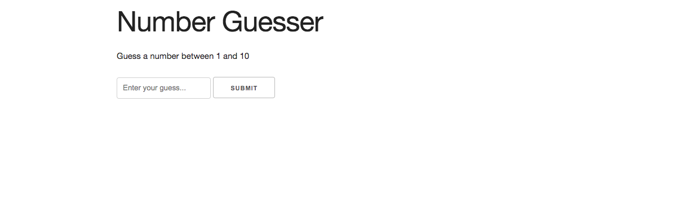
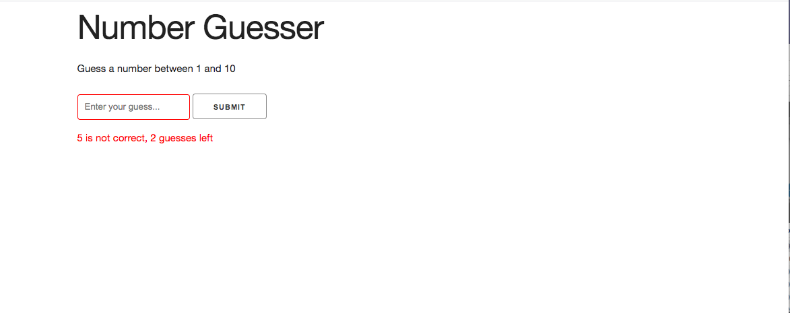
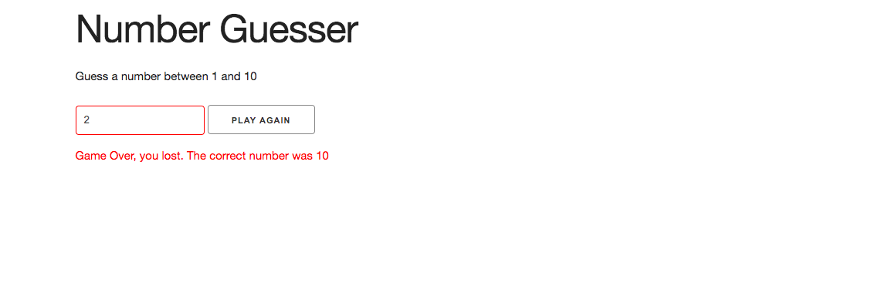
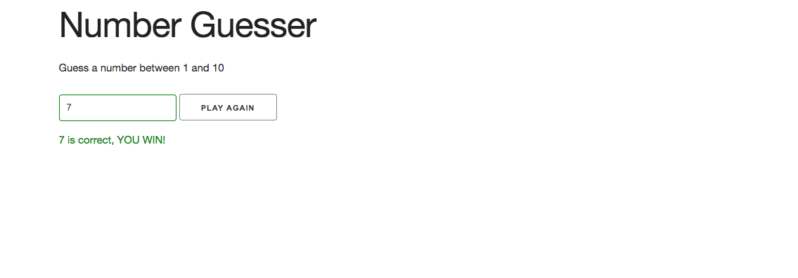

# Number-Guesser

## Application  description:

In this game, the user has 3 attepmts to guess a  random number between 1 and 10. For each guess they get wrong, a message will displaying saying how many guess they have left. If they get all guesses wrong, a message will pop up saying they lost the game and if they want to play again, if they get the answer right, the game will display that they won and if they want to play again. 

 ## Click [here](https://brianlevin.github.io/Number-Guesser/) for the live app. 
 
 This is the home screen:
 
 
  
  
 The player puts in the incorrect answer
  
  
  The player loses the game:
    
   
   The player wins the game:
      
     
     
   The player can restart the game if they win or lose:
   
         
     
 
 ## Libraries and Frameworks:

- HTML
- CSS
- Javascript

## Email:

bml201095@gmail.com
